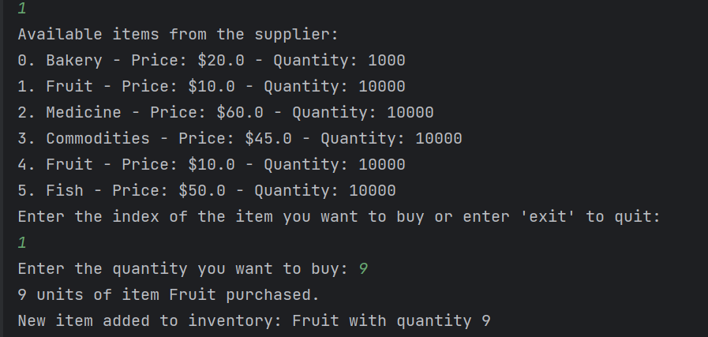

<h1 align="center"><strong>Supermarket Management System</strong></h1>

## Table of Contents
- [Technology](#technology)  
- [Goal](#goal)  
- [Functionalities](#functionalities)  
- [UML Diagram](#uml-diagram)

<h3>:computer:<strong>Technology</strong></h3> 

- **Java**
- **IntelliJ IDEA**

<h3><strong>Goal</strong></h3> The goal of the application supermarket is to apply the fundamental of OOP such as
inheritance , Polymorphism , Encapsulation and Abstraction , and also to
use the concept of design pattern in the code

<h3><strong>Functionalities</strong></h3> 
The dummy client will have an initial budget of 100000\$ to manage his
supermarket

The items to be purchased by the client were created initially with the
Builder Design pattern.

Functions:

**1-Buy items from suppliers:**

Different product can be purchased by the client from the supplier. To
choose the product, the client will select the product by entering its
index, the quantity

Once the item is added, its quantity will be reduced and then it will be
added to the inventory of the client .

The client can continue purchasing as much as he/she wants until he/she
decides to stop his/her purchase, and his/her inventory, remaining money
as well as money left will be displayed.

**2-Sell Items:**

After
the item is sold, the inventory and the budget are updated. It is
important to note that the budget increased because the selling price \>
purchasing price.

**3-View inventory & remaining budget:**

In our case, 7 fruits were sold from 9 =\> there is 2 fruits left in the
inventory

**4-Pay employees:**

The client can pay his employee

The payment is made according to the time spent they worked , and it is
programmed to be automatic

public void payEmployees() {  
long currentTimeMinutes = System.*currentTimeMillis*() / (60 \* 1000);  
long timeElapsedSinceLastPayment = currentTimeMinutes -
lastPaymentTimeMinutes;  
  
  
double totalPayment = 0.0;  
for (Employee employee : employees) {  
totalPayment += employee.salary \* timeElapsedSinceLastPayment;  
}  
  
  
if (budget \>= totalPayment) {  
  
budget -= totalPayment;  
  
  
totalPaidToEmployees += totalPayment;  
lastPaymentTimeMinutes = currentTimeMinutes;  
  
  
System.*out*.println("Paid \$" + totalPayment + " to employees.");  
  
System.*out*.println("Total paid until now \$" +
totalPaidToEmployees);  
  
System.*out*.println("Budget \$" + budget);  
  
} else {  
System.*out*.println("Insufficient budget to pay employees.");  
}  
}  
  
  
}

**5-View Profits:**

**6-View Expenses:**

<h3><strong>UML Diagram</strong></h3>

The diagram shows the different relationship between the different
classes in the application

